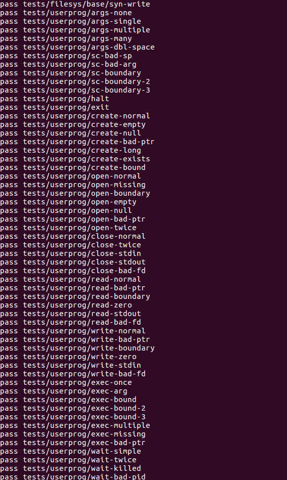
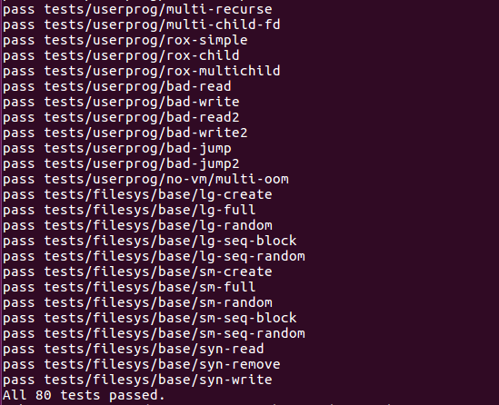

# Project 2: User Programs

Group member:

11611712 杨寒梅

11611725 朱怀生

## Task1 argument passing

### 1.1 Data structure and functions

In this task, we mainly modify `process.c` and deal with strings. However, to test the correctness of our algorithm in this task, we must also implement `syscall_write` in `syscall.c`.

#### 1.1.1 Data structure

No complex data structure, only use `string`s and `int`s

#### 1.1.1 Functions

- <process.c> :
  - modify `process_execute (const char *file_name)`
  - modify `start_process (void *file_name_)`
  - add `push_argument(void **esp,int argc, int argv[])`
  - modify `process_wait (tid_t child_tid)`
- <syscall.c>
  - add `sys_write(int fd, const void *buffer, unsigned size, int* ret)`

### 1.2 Algorithms

Since the implementations of  `process_wait (tid_t child_tid)` and `syscall_write(struct intr_frame *f)` are just for testing the algorithm of argument passing. So we won't get into much details about them in this section, we'll discuss it in the task2.

<process.c> :

The function `process_execute` provides `file_name`, which includes command and arguments string. 

First, split the `file_name` to separate the command and arguments. We take this command as the new thread's name and then, pass the arguments to function `start_process`,` load` and `setup_stack`.

After analysing the original pintos code, we know that after `process_execute` creates the thread, user program doesn't execute immediately, it enters the `start_process` and this function invoke `load`, which will allocate memory for user programs. So the time to set up the stack is after `load`.

To set up the stack, we first memcpy the arguments and command name and save their address for future usage. Then add alignment, and `argv`'s address stored before also make sure `argv[argc]` is a null pointer. Next add the address of `argv`, `argc` and finally a `return` address.

We create function `push_argument` to do split the argument by `argv` in the `start_process`.
### 1.3 Synchronization

When parsing the command line, we use `strtok_r` given by pintos rather than `strtok`. The difference between `strtok` and `strtok_r` is that the latter is threadsafe. The `save_ptr` in `strtok_r` is provided by the caller but  `strtok`  relies on a pointer to remember where it was looking for. Thread may be interrupted at any time, so it's important to be threadsafe.

We use the `filesys_lock` to do file operation by adding method in `thread.c` and `thread.h`.
```C
/*Do file lock operation*/
void acquire_lock_f(){
  lock_acquire(&lock_f);
}
void release_lock_f(){
  lock_release(&lock_f);
}
```

### 1.4 Rationale

In this task, we split the command name and other arguments and pass them to the function `load` and add them into the stack with correct order. The main purpose of this task is to assign the parameters to a specific stack in a specific order and the logic is clear.


## Task 2 Process Control Syscalls

### 2.1 Data structures and functions

#### 2.1.1 Data structure

- <thread.h>

  - We create a new struct called `child`

  ```C
  struct child
    {
      tid_t tid;                           /* tid of the thread */
      bool isrun;                          /* whether the child's thread is run successfully */
      struct list_elem child_elem;         /* list of children */
      struct semaphore sema;               /* semaphore to control waiting */
      int store_exit;                      /* the exit status of child thread */
    };
  ```
  
  - We add some new attributes to the struct `thread`
  
  ```C
  struct list childs;                 /* The list of childs */
  struct child * thread_child;        /* Store the child of this thread */
  int st_exit;                        /* Exit status */
  struct semaphore sema;              /* Control the child process's logic, finish parent waiting for child */
  bool success;                       /* Judge whehter the child's thread execute successfully */
  struct thread* parent;              /* Parent thread of the thread */
  ```
  
- <syscall.c>
  - We create a new struct called `syscalls`
  ```C
  struct list files;                  /* List of opened files */
  int file_fd;                        /* File's descriptor */
  struct file * file_owned;           /* The file opened */
  ```


#### 2.1.2 Functions

- <syscall.c>
  - add `get_user (const uint8_t *uaddr)`
  - modify `syscall_handler (struct intr_frame *f) `
  - modify `syscall_init (void) `
  - add `sys_halt (intr_frame* f)`, `sys_exit (intr_frame* f)`, `sys_exec (intr_frame* f)`, `sys_write(intr_frame* f)`, `int sys_wait(intr_frame* f);`

### 2.2 Algorithms

In this task, we need to finish 4 syscalls

```C
SYS_HALT, /* shutdown the system */
SYS_EXEC, /* start a new program with process_execute() */
SYS_WAIT, /* wait for a specific child process to exit */
SYS_PRACTICE /* adds 1 to its first argument, and returns the result */
```

<process.c>:

In function `process_execute`,  invoke `sema_down` for the current thread to synchronize its execution. If the process is executed successfully, return the child process’s tid; else return `TID_ERROR`.

In function `process_wait`, we'll check if `child_tid` exists in  `thread_current()->childs` . If not this function will return -1, else we'll check if the child has been waited before, since the document stipulates that a child should only been waited for at most once. If it has been waited before, return -1, else set the waiting flag true(success). After checking, we down the semaphore `sema` to block the process until the child terminates, Finally we remove the child process from `childs` and return its `store_exit`.

<syscall.c>:

we have a function `syscall_handler` with switch-case to execute corresponding code. The system call type is read from the user process’s stack. However, since they are in the user process's virtual address space, we should check whether the address is pointed to a valid address before executing system calls. The specific verification includes check if the address is below `PHYS_BASE`, if the address is mapped, or if it is null. If the address is invalid, then we need to free the memory page and release any locks or semaphores from this process before exiting. 

**halt**

Implemented by function `sys_halt (intr_frame* f)`, just call function `shutdown_power_off`.

**exec**

Implemented by function `sys_exec (intr_frame* f)`, first to check if the file referred by `file_name` is valid (whether the pointer to memeory address, page and content of page are valid). If it is invalid, return -1, else we call function `process_execute (const char *file_name)`.

**wait** 

Implemented by function `sys_wait(pid_t pid)`, first check if the argument it passed (the pid) is valid. If it is invalid, return -1, else we call function `process_wait (tid_t child_tid)` implemented in task 1.

**practice**

The practice syscall just adds 1 to its first argument `argv[0]`, and returns the result 


### 2.3 Synchronization
In the process of execution of process, execute will return -1 if the process fails, it can't return. To solve this, we add `success` to struct `thread` to record whether the thread exectue successfully. What' more, we use struct thread `parent` to get its parent and set its status according to the result of loading. It's a good design to record child's executing result in parent instead of child. Last but not least, we use semaphore to realize "parent" waits for "child". When a child process is created, it will down `sema` to block the parent. When the child finish, it will up `sema` to wake up his parent.  

In the process of wating of process(we realize the waiting process by semaphore), when a "parent" need to wait his "child", `sema_down` is called to block the parent. And when the "child" finishes, the "parent" will wake up.


### 2.4 Rationale

In this task, we finish three kernel system calls and one for practice. To achieve the goal, we create a new structure named `child` and add some atrributes to the struct `thread`. Semaphores are used in this task to prevent race condition. What's more, we store a thread's parent for it and such kind of design make us more eficient to find parent thread (we will change the status of parent more quickly).

## Task 3 File Operation Syscalls

### 3.1 Data structure and functions

#### 3.1.1 Data structure

<thread.h>

* We add some new attributes to the struct `thread`

```C
struct list files; /* the list of opened files */
int file_fd; /* File's number thread has */
struct file * file_owned; /* the file opened */
```

<syscall.h>

- We create a new struct called `process_file`

```C
struct thread_file{
    int fd;
    struct file* file;
    struct list_elem file_elem;
};
```

#### 3.1.2 Functions

* <syscall.c>
  * modify `syscall_handler (struct intr_frame *)`

  * modify `syscall_init (void)`

  * add syscall functions

    ```C
    void sys_create(struct intr_frame* f); /* syscall create */
    void sys_remove(struct intr_frame* f); /* syscall remove */
    void sys_open(struct intr_frame* f);/* syscall open */
    void sys_wait(struct intr_frame* f); /*syscall wait */
    void sys_filesize(struct intr_frame* f);/* syscall filesize */
    void sys_read(struct intr_frame* f);  /* syscall read */
    void sys_write(struct intr_frame* f); /* syscall write */
    void sys_seek(struct intr_frame* f); /* syscall seek */
    void sys_tell(struct intr_frame* f); /* syscall tell */
    void sys_close(struct intr_frame* f); /* syscall close */
    ```
  * add `is_valid_pointer(void* esp,uint8_t argc)`

  * add `find_file_id(int file_id)`

  * add `check_ptr2(const void *vaddr)`
* <thread.c> && <thread.h>
  * add a global file lock to gurantee the safety of thread
  ```C
  /*Use a lock to lock process when do file operation*/
  static struct lock c;
  ```
  * add file lock functions
  ```C
  void acquire_lock_f(){
  	lock_acquire(&lock_f);
  }
  void release_lock_f(){
  	lock_release(&lock_f);
  }
  ```
  * modify some initialization function in the thread.c
### 3.2 Algorithms

In this task, we need to implement another 9 syscalls concerning file operation  syscalls: create, remove, open, filesize, read, write, seek, tell, and close. When a user program is running, we must ensure that nobody can modify its executable file on the disk. For this task, we use a global lock to ensure the file syscalls is thread safe. When every syscall is called, it must acquire lock and after then, release the lock.  

Besides, the filesystem of Pintos is not thread-safe, file operation syscalls cannot call multiple filesystem functions concurrently. To ensure this, we add a new variable `file_fd` into struct `thread` to keep the file desciptor larger than `STDIN_FILENO` and `STDOUT_FILENO`, `file_owned` is to keep a thread’s opened files.

The function `syscall_handler` will determine which kind of syscall function to execute. All arguments are already in the stack when a user program invoke a syscall. So, we just need to get the parameter from the stack. Each file syscalls will call the corresponding functions in the file system library in `filesys.c` after it acquires global file system lock, this lock will be released at last.

The function `syscall_init (void)` will initialize `syscalls` to store the function of syscalls in this task.

The function  `is_valid_pointer(void* esp,uint8_t argc)` is used to do unknown bugs in test `bad-read`. This function is just used to check whether the memory is valid and it is just used in `sys_read`

The function `special_eixt` is used to pass the special test which have invalid memory,page and wrong content of page. We will kill the process and exit with -1 by `printf`.

The function `check_ptr2` is used to check whether there is some mistakes like invalid memory, page and wrong content of page for each syscall.

**create**

Implemented by function `sys_create(struct intr_frame* f)`, just call function `filesys_create` and acquire lock by `acquire_lock_f()`, release it after finishing by `release_lock_f()`. This lock process will be used in other filesystem operation in the following methods.

**remove**

Implemented by function `sys_remove(struct intr_frame* f)`, just call function `filesys_remove (const char *name)`.

**open**

Implemented by function `sys_open(struct intr_frame* f)`,fisrt we need to open the file first by function `filesys_open (const char *name)`. Then we need to push the file with structure `thread_file` to the thread's opened file's list `files`.

**write**

Implemented by function `sys_write(struct intr_frame* f)`, first we need to judge whether we will write to stdout or files. If it will be written to stdout, we use function `putbuf (const char *buffer, size_t n)` to finish it. If it will be written to  files, first we find the file by id `find_file_id(int file_id)` in current thread, then do write operation by `file_write (struct file *file, const void *buffer, off_t size) `.

**seek**

Implemented by function `sys_seek(struct intr_frame* f)`, just call function `file_seek (struct file *file, off_t new_pos)`.

**tell**

Implemented by function `sys_tell(struct intr_frame* f)`, first find the file from `find_file_id(int file_id)`. Then call function `file_tell (struct file *file) ` to do syscall tell.

**close**

Implemented by function `sys_close(struct intr_frame* f)`, first find the file from `find_file_id(int file_id)`. Then call function `file_close (struct file *file) ` to do syscall close. Finally, we remove the file in the thread's list and free the file.

**filesize**

Implemented by function `sys_filesize(struct intr_frame* f)`, first find the file from `find_file_id(int file_id)`. Then call function `file_length (struct file *file) ` to do syscall filesize.


### 3.3 Synchronization

All the file operations are protected by the global file system lock, which can prevent I/O on the same fd at the same time. First, we'll check whether the current thread is holding the global lock `lock_f` . If so, we release it. Then we have to close all the file the current thread opens and free all its child. Also, we disable the interruption, when we go through `thread_current()->parent->childs` or `thread_current()->files`, to prevent unpredictable error or race condition in context switch. So they will not cause race conditions. 

### 3.4 Rationale

In this task, we finish nine kernel system calls for file systems. To achieve the goal, we create a new structure named `thread_file` and add some atrributes to the struct `thread`. Locks are used in this task to prevent race condition. What's more,some special situation like invalid memory, page and file has been considered by killing the process by `special_exit`.

## Results

We pass all 80 tests.  



## Questions

**Q1: A reflection on the project–what exactly did each member do? What went well, and what could be improved?**

- Task1 :
  - Code : Hanmei Yang
  - Report : Hanmei Yang
- Task2:
  - Code : Huaisheng Zhu & Hanmei Yang
  - Report : Hanmei Yang
- Task3:
  - Code: Huaisheng Zhu
  - Report: Huaisheng Zhu

What went well: We have a good division and cooperation. Every people focus on his/her job and if someone have problems, we discuss with each other and share our ideas. Due to the good teamwork, we finish this project quickly.

What could be improved: The time schedule for this project is really tight, we should start earier to make a more thorough design. When we finish task 1, it took many times to figure out the reason why it didn't work, that is we didn't implement the system write. Orginally we thought the thread creation is to blame and this misdirected idea affected the progress of this project.

**Q2: Does your code exhibit any major memory safety problems (especially regarding C strings), memory leaks, poor error handling, or race conditions?**   

Yes. When we do test `exec-bound-2` and `sc-boundary-2`, the invalid memory pointer(doesn't at the first argument) and syscall causes memory leak. So we use method `check_ptr` to check it.

**Q3: Did you use consistent code style? Your code should blend in with the existing Pintos code. Check your use of indentation, your spacing, and your naming conventions.** 

Yes. Our codes are consistent with the style of existing Pintos code. Take the methods' definition for example, the return type and other keywords are in one line, and the method name and parameters are in the next line. We leave each left parentheses `(`  a space between the before character. And each left brace `{` occupies one line. In terms of naming conventions, we notice that the functions and variables in pintos both use underline-naming principle, so we also use this kind of convention.

**Q4: Is your code simple and easy to understand?** 

Yes. The codes we implement are consistent with the algorithm part discussed before, we don't add a redundant line. We add comments to important algorithm and parameters(The process to finish this project is also shown in the comment). And as the algorithm part shows, our algorithm is simple enough and readable.


**Q5: If you have very complex sections of code in your solution, did you add enough comments to explain them?** 

Yes. We explain every parameter and the important line in these complex sections.

**Q6: Did you leave commented-out code in your final submission?** 

No. We remove them in the final version.

**Q7: Did you copy-paste code instead of creating reusable functions?** 

No. If some codes will repeat, we encapsulate the codes into a function and just invoke the function when needed. We will check the invalid memory for each system call, but different system calls need to check different things. So we use function `check_ptr2` for all system calls (`check_ptr2` is a new version to solve special situation).  

**Q8: Are your lines of source code excessively long? (more than 100 characters)**   

No.

**Q9: Did you re-implement linked list algorithms instead of using the provided list manipu-**
**lation?**   

No.

